# 🍕 La Belle Assiette — Restaurant + Système de Commande

Application web complète de restaurant avec commande en ligne.
**Stack:** HTML · CSS · JavaScript · PHP · MySQL

---

## 📁 Structure du Projet

```
restaurant/
├── index.php               ← Page d'accueil (menu + panier)
├── connexion.php           ← Page de connexion
├── inscription.php         ← Page d'inscription
├── mes-commandes.php       ← Historique des commandes (client)
│
├── php/
│   ├── config.php          ← Configuration DB + helpers
│   ├── auth.php            ← Inscription / Connexion / Déconnexion
│   └── panier.php          ← API panier + commandes (JSON)
│
├── css/
│   └── style.css           ← Feuille de style principale
│
├── js/
│   └── app.js              ← JavaScript (panier, filtres, toasts)
│
├── admin/
│   ├── dashboard.php       ← Tableau de bord admin
│   ├── commandes.php       ← Gestion des commandes
│   ├── plats.php           ← Ajouter / modifier / supprimer des plats
│   └── clients.php         ← Liste des clients inscrits
│
└── database.sql            ← Script SQL (création + données initiales)
```

---

## ⚙️ Installation

### 1. Prérequis
- **XAMPP** (ou WAMP / LAMP) avec Apache + PHP 8.0+ + MySQL
- Navigateur web moderne

### 2. Copier les fichiers
Copiez le dossier `restaurant/` dans :
```
C:\xampp\htdocs\restaurant\        (Windows)
/opt/lampp/htdocs/restaurant/      (Linux)
/Applications/XAMPP/htdocs/restaurant/  (Mac)
```

### 3. Créer la base de données
1. Démarrez **XAMPP** (Apache + MySQL)
2. Ouvrez **phpMyAdmin** → http://localhost/phpmyadmin
3. Cliquez sur **"Importer"**
4. Choisissez le fichier `database.sql`
5. Cliquez **"Exécuter"**

### 4. Configurer la connexion
Ouvrez `php/config.php` et adaptez si nécessaire :
```php
define('DB_HOST', 'localhost');
define('DB_USER', 'root');     
define('DB_PASS', '');         
define('DB_NAME', 'restaurant_db');
```

### 5. Lancer l'application
Ouvrez votre navigateur → http://localhost/restaurant

---

## 🔑 Comptes de test

| Rôle  | Email             | Mot de passe |
|-------|-------------------|--------------|
| Admin | admin@resto.fr    | password     |

Créez un compte client directement via la page d'inscription.

---

## 🚀 Fonctionnalités Détaillées

---

### 🏠 Page d'accueil — Hero Section

La page d'accueil accueille le visiteur avec une section hero à fond sombre, une image d'ambiance restaurant, le nom de l'établissement en typographie italique colorée, et deux boutons d'action principaux : **Voir le menu** et **Créer un compte**. Une barre de features rappelle les arguments clés : délai de livraison, note, paiement sécurisé et ingrédients frais.


---

### 📋 Menu avec Filtres par Catégorie

Le menu affiche **36 plats disponibles** répartis en 9 catégories : Tous, Entrées, Pizzas, Pâtes, Grillades, Burgers, Charcuterie, Protéines, Desserts, Boissons. Un clic sur un bouton de filtre masque instantanément les plats hors catégorie et met en surbrillance le filtre actif (rouge plein). Le filtrage est entièrement côté client en JavaScript, sans rechargement de page.

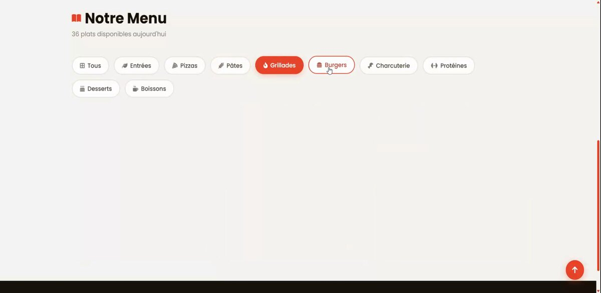

---

### 🃏 Grille des Plats

Chaque plat est présenté sous forme de carte avec photo, badge de catégorie, nom, description courte, prix en rouge et un bouton `+` d'ajout au panier. Au survol, la carte se lève légèrement et la photo zoome doucement. Les cartes s'animent à l'apparition avec un décalage en cascade (stagger).

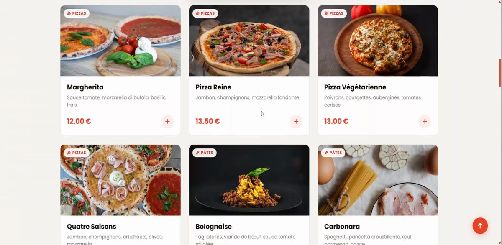

Toutes les catégories sont couvertes, y compris les desserts et boissons affichés en bas de page avec le footer du site.


---

### 🛒 Panier Latéral Dynamique

En cliquant sur le bouton **Panier** dans la navbar, un panneau coulissant s'ouvre sur la droite sans quitter la page. Il affiche chaque article avec sa photo miniature, son nom, son prix unitaire et des boutons `−` / `+` pour modifier la quantité. Le sous-total, les frais de livraison et le **total** sont calculés en temps réel. Un toast de confirmation (« Ajouté au panier ! ») apparaît à chaque ajout.

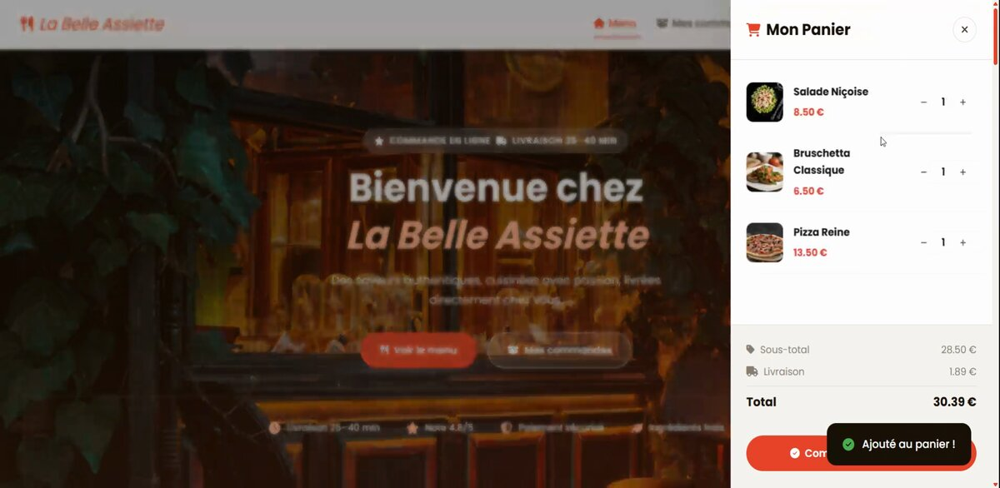

---

### ✅ Finalisation de Commande

En cliquant sur **Commander**, une modale s'ouvre pour saisir l'adresse de livraison et le numéro de téléphone. La validation des champs est visuelle : bordure verte si valide, rouge si invalide. Un champ optionnel permet d'ajouter des notes pour le livreur (étage, digicode…), avec un compteur de caractères (0 / 300).

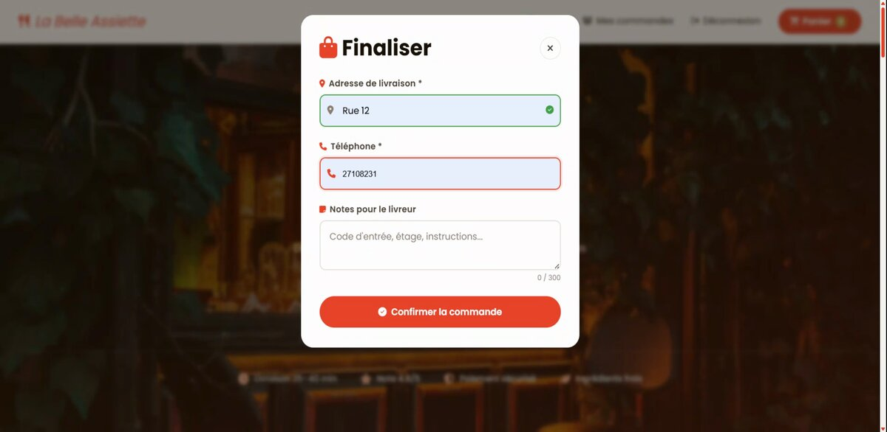

---

### 📦 Historique et Suivi des Commandes

La page **Mes Commandes** liste toutes les commandes du client connecté avec leur numéro, date, statut coloré et montant total. Chaque commande déroule le détail des articles commandés, les **ingrédients** sélectionnés sous forme de chips, l'adresse et le téléphone de livraison.

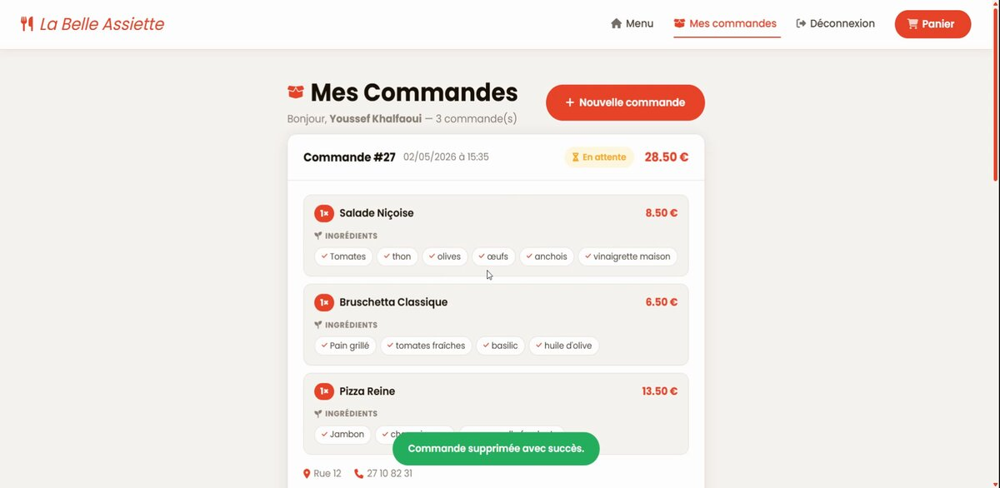

Une **barre de progression en 5 étapes** (Reçue → Confirmée → En cuisine → Prête → Livrée) indique visuellement l'avancement en temps réel de chaque commande.

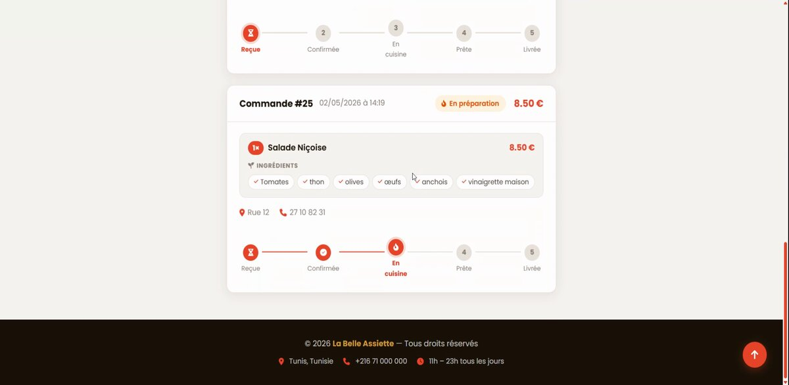

---

### 👤 Inscription Client

La page d'inscription collecte le prénom, nom, adresse e-mail, mot de passe (avec indicateur de robustesse et bouton œil pour afficher/masquer), numéro de téléphone et adresse de livraison par défaut. La validation en temps réel marque chaque champ valide (vert) ou invalide (rouge) dès la saisie.

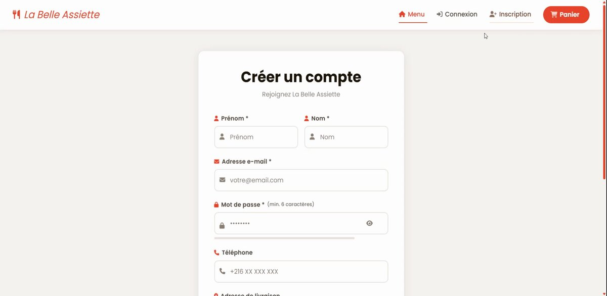

---

### 🔧 Admin — Tableau de Bord

Le tableau de bord administrateur affiche 5 métriques en temps réel : commandes totales, commandes du jour, revenus totaux, revenus du jour et nombre de clients inscrits. Un tableau des dernières commandes est affiché directement en bas de page. Des badges en haut à droite signalent les commandes **En attente** et **En préparation** nécessitant une attention immédiate.

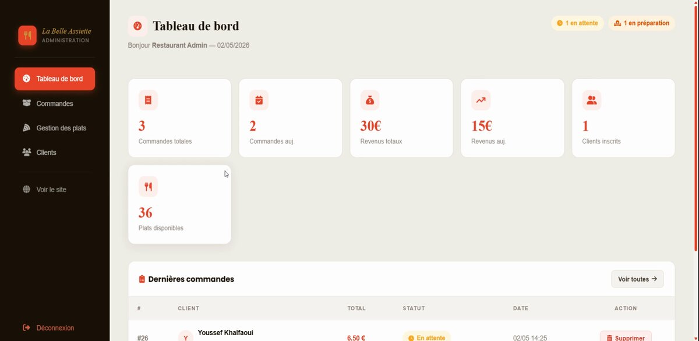

---

### 📋 Admin — Gestion des Commandes

La page commandes liste toutes les commandes avec filtre par statut (Toutes / En attente / Confirmée / En préparation / Prête / Livrée). Pour chaque commande, l'admin voit le client, son adresse, le total, le statut actuel et un menu déroulant pour **changer le statut** instantanément. Un bouton de suppression est également disponible.

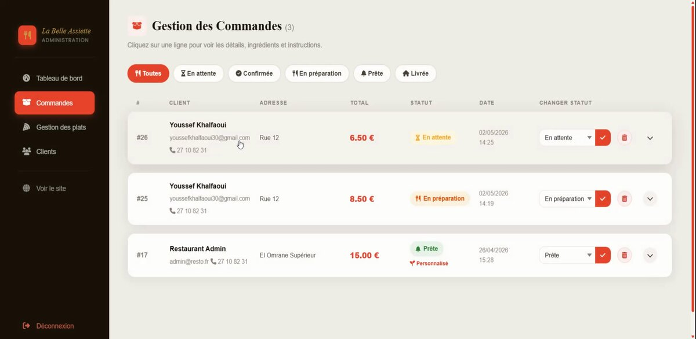

---

### 🍽️ Admin — Gestion des Plats

La page de gestion des plats liste l'intégralité du menu avec photo miniature, description, catégorie, prix et un **toggle on/off** pour activer ou désactiver un plat du menu sans le supprimer. Des boutons d'édition (crayon) et de suppression (poubelle) permettent de modifier ou retirer chaque plat.

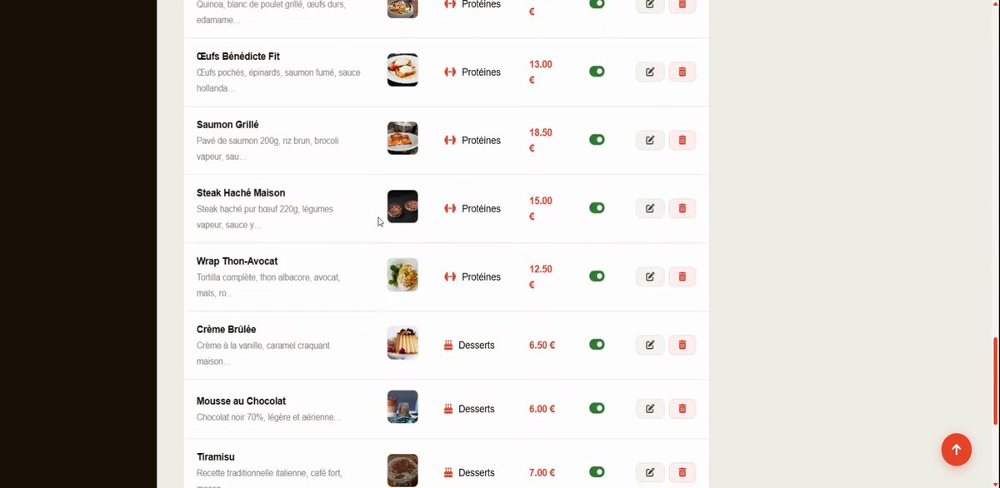

---

### 👥 Admin — Liste des Clients

La page clients affiche un tableau de tous les utilisateurs inscrits avec leur nom, contact (email + téléphone), le nombre de commandes passées, le total dépensé et la date d'inscription. Cela permet à l'admin de suivre l'activité de chaque client.

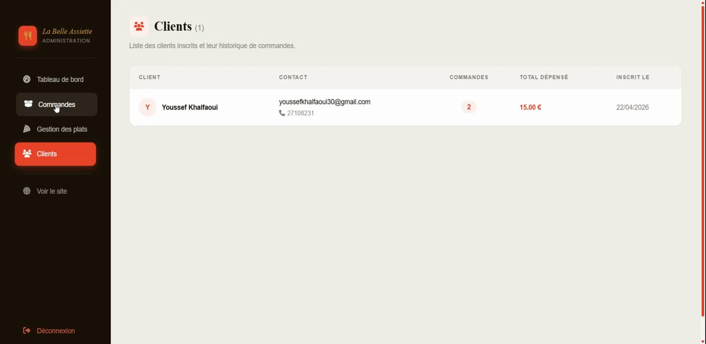

---

## 🗄️ Base de Données

| Table               | Description                          |
|---------------------|--------------------------------------|
| `utilisateurs`      | Clients et administrateurs           |
| `categories`        | Catégories du menu (Pizzas, etc.)    |
| `plats`             | Plats avec prix et description       |
| `commandes`         | Commandes passées                    |
| `commande_details`  | Détail des plats par commande        |


